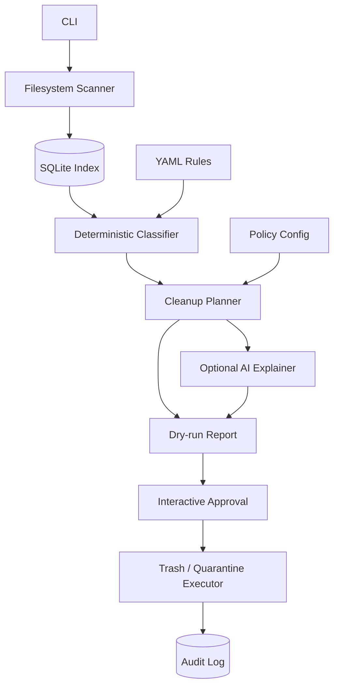

# tidyfs

`tidyfs` is a smart disk-usage and cleanup planning CLI for developer machines.

The goal is not to build an autonomous AI file deleter. The goal is to build a conservative filesystem intelligence tool that can answer:

- What is using disk?
- What generated it?
- What is probably reclaimable?
- What is safe enough to propose?
- What would be done?
- Can it be undone?

The core cleaner is deterministic. AI is optional and used for explanation, ranking, and rule drafting only.

## Project status

Early design / planning stage.

The intended first milestone is:

```bash
tidyfs scan ~
tidyfs top
tidyfs explain ~/.cache
tidyfs plan --safe
tidyfs clean --dry-run
```

Real cleanup should initially be dry-run only. Reversible cleanup via trash/quarantine comes later.

## Design principles

### 1. AI is not the authority

```text
scanner finds facts
rules create candidates
policy validates candidates
AI explains and ranks
executor acts only on validated, approved candidates
```

AI must not:

- invent paths to clean
- invent shell commands
- lower risk classifications
- override policy
- inspect sensitive file contents by default
- directly authorize deletion

### 2. Safe by default

Defaults should be boring and conservative:

- no permanent deletion in early versions
- dry-run first
- move to trash/quarantine before purge
- audit every action
- never touch secrets, source repos, databases, VM images, browser profiles, or unknown user data by default

### 3. Tool-native cleanup where possible

Some systems should not be cleaned with raw file deletion.

Examples:

- Nix: use `nix-collect-garbage`, never manually delete `/nix/store`
- Docker/Podman: use `docker system df`, `docker system prune`, etc.
- systemd journal: use `journalctl --disk-usage`, `journalctl --vacuum-*`
- language caches: prefer package-manager-native cleanup commands when reliable

### 4. Reuse mechanics, own the safety boundary

Use proven libraries and tools for traversal, indexing, trash, and adapters, but keep these parts owned by `tidyfs`:

- risk model
- policy model
- cleanup candidate model
- adapter allowlists
- audit log
- quarantine/restore model
- AI trust boundary

## Intended architecture



## Planned commands

```bash
# Index filesystem metadata
tidyfs scan ~

# Show largest directories/files
tidyfs top
tidyfs top --depth 3
tidyfs top ~/.cache

# Explain what a path appears to be
tidyfs explain ~/.cache/pip

# Build a cleanup proposal
tidyfs plan --safe
tidyfs plan --risk medium

# Preview cleanup only
tidyfs clean --dry-run

# Later: reversible cleanup
tidyfs clean --safe --interactive
tidyfs restore

# Later: optional AI explanation
tidyfs ask "what can I safely clean to reclaim 20GB?"
tidyfs explain ~/.cache --ai
```

## Planned implementation stack

Initial implementation target: Rust.

Likely dependencies:

| Concern | Candidate crates/tools |
|---|---|
| CLI | `clap` |
| traversal | `jwalk`, `walkdir`, `ignore` |
| path rules | `globset` |
| storage | `rusqlite`, SQLite |
| config/rules | `serde`, `serde_yaml`, `toml` |
| logging | `tracing`, `tracing-subscriber` |
| errors | `anyhow`, `thiserror` |
| trash | `trash` |
| prompts | `inquire` |
| hashing later | `blake3` |
| AI later | Ollama/OpenAI-compatible HTTP client |

## Documentation

- [Architecture](docs/architecture.md)
- [Safety model](docs/safety-model.md)
- [Implementation plan](docs/implementation-plan.md)
- [Reuse strategy](docs/reuse-strategy.md)
- [Adapters](docs/adapters.md)
- [AI usage](docs/ai-usage.md)
- [Threat model](docs/threat-model.md)

## Non-goals for the MVP

- autonomous cleanup
- permanent deletion
- arbitrary shell command generation
- AI-driven deletion decisions
- full duplicate-photo cleanup
- vector/RAG subsystem
- GUI/TUI
- Windows/macOS support

Those may be explored later, but the first useful version should be a reliable, conservative Linux developer-machine analyzer and cleanup planner.
