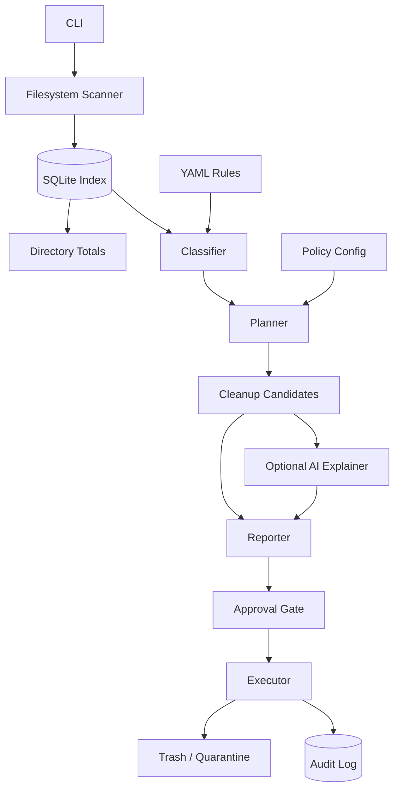
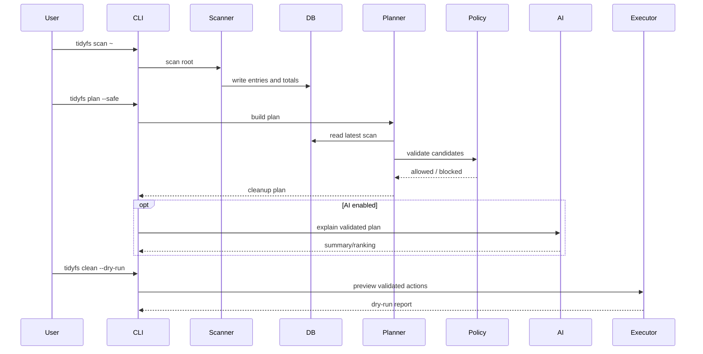

# Architecture

`tidyfs` is organized around a strict separation of facts, policy, explanation, and execution.

## Mental model

```text
filesystem facts -> classifications -> cleanup candidates -> policy validation -> approval -> reversible execution
```

AI, if enabled, operates only over validated summaries and cleanup plans. It does not perform scanning, policy decisions, or execution.

## High-level components



## Component responsibilities

### CLI

Responsibilities:

- parse commands and flags
- route to subcommands
- configure logging
- locate config, rules, and SQLite DB
- present errors clearly

Initial commands:

```bash
tidyfs scan ~
tidyfs top
tidyfs explain ~/.cache
tidyfs plan --safe
tidyfs clean --dry-run
```

### Scanner

Responsibilities:

- walk a root path
- collect metadata
- avoid following symlinks by default
- tolerate permission errors
- optionally stay on one filesystem
- record scan errors
- store raw facts in SQLite

Scanner does not decide what is safe to delete.

### SQLite index

Stores:

- scans
- entries
- directory totals
- classifications
- cleanup candidates
- actions

SQLite is the authority for measured disk facts.

### Classifier

Labels known patterns:

- `cache`
- `thumbnail_cache`
- `python_cache`
- `node_dependencies`
- `rust_build_artifacts`
- `docker_data`
- `nix_store`
- `systemd_journal`
- `source_repo`
- `secret_material`
- `database`
- `vm_image`
- `unknown`

Classification answers: **what is this?**

### Rule engine

Matches filesystem facts and classifications against YAML rules.

Rule examples:

- old thumbnail cache
- old pip cache
- stale `node_modules` with lockfile
- Rust `target` directories
- known temp/cache directories

Rules produce cleanup candidates, not actions.

### Planner

Combines:

- scan facts
- classifications
- rules
- policy
- command-line risk threshold

Planner output:

- allowed cleanup candidates
- blocked candidates
- report-only findings

Planning answers: **what could be proposed?**

### Policy validator

Blocks or escalates candidates.

Examples:

- never touch `.ssh`
- never touch `.gnupg`
- never touch `.git`
- never touch `.env`
- never touch local DBs
- never touch VM images
- do not cross filesystem boundaries unless requested
- require interactive approval for medium risk and above

### Executor

Executes only already validated and approved candidates.

Initial execution mode:

- dry-run only

Later execution mode:

- move to trash
- move to quarantine
- write manifest
- support restore

No permanent deletion in MVP.

### Adapters

Adapters inspect and optionally run tool-native cleanup commands.

Examples:

- Nix
- Docker
- Podman
- systemd journal
- pnpm
- pip
- uv
- Go
- Cargo

Adapters must use allowlisted commands only.

### AI explainer

Optional.

AI can:

- explain disk usage
- rank existing candidates
- explain risk/tradeoffs
- summarize cleanup plans
- draft disabled rule proposals

AI cannot:

- invent executable commands
- invent cleanup paths
- lower risk
- override policy
- trigger execution

## Data flow



## Storage model

Core tables:

```sql
CREATE TABLE scans (
  id INTEGER PRIMARY KEY,
  root_path TEXT NOT NULL,
  started_at INTEGER NOT NULL,
  finished_at INTEGER,
  status TEXT NOT NULL
);

CREATE TABLE entries (
  id INTEGER PRIMARY KEY,
  scan_id INTEGER NOT NULL,
  path TEXT NOT NULL,
  parent_path TEXT,
  name TEXT NOT NULL,
  entry_type TEXT NOT NULL,
  size_bytes INTEGER NOT NULL,
  allocated_bytes INTEGER,
  mtime INTEGER,
  atime INTEGER,
  ctime INTEGER,
  uid INTEGER,
  gid INTEGER,
  mode INTEGER,
  dev INTEGER,
  inode INTEGER,
  extension TEXT,
  symlink_target TEXT,
  error TEXT
);

CREATE TABLE directory_totals (
  scan_id INTEGER NOT NULL,
  path TEXT NOT NULL,
  total_size_bytes INTEGER NOT NULL,
  allocated_size_bytes INTEGER,
  file_count INTEGER NOT NULL,
  dir_count INTEGER NOT NULL,
  max_mtime INTEGER,
  PRIMARY KEY (scan_id, path)
);

CREATE TABLE classifications (
  scan_id INTEGER NOT NULL,
  path TEXT NOT NULL,
  label TEXT NOT NULL,
  confidence REAL NOT NULL,
  source TEXT NOT NULL,
  reason TEXT
);

CREATE TABLE cleanup_candidates (
  id INTEGER PRIMARY KEY,
  scan_id INTEGER NOT NULL,
  path TEXT NOT NULL,
  size_bytes INTEGER NOT NULL,
  rule_id TEXT NOT NULL,
  category TEXT NOT NULL,
  risk TEXT NOT NULL,
  action_type TEXT NOT NULL,
  reversible INTEGER NOT NULL,
  reason TEXT NOT NULL,
  blocked INTEGER NOT NULL DEFAULT 0,
  blocked_reason TEXT
);

CREATE TABLE actions (
  id INTEGER PRIMARY KEY,
  timestamp INTEGER NOT NULL,
  scan_id INTEGER,
  path TEXT NOT NULL,
  action_type TEXT NOT NULL,
  size_bytes INTEGER,
  rule_id TEXT,
  risk TEXT,
  status TEXT NOT NULL,
  restore_path TEXT,
  error TEXT
);
```

## Design constraint

The executor must never operate from raw AI output. It only consumes validated cleanup candidates produced by deterministic code.
