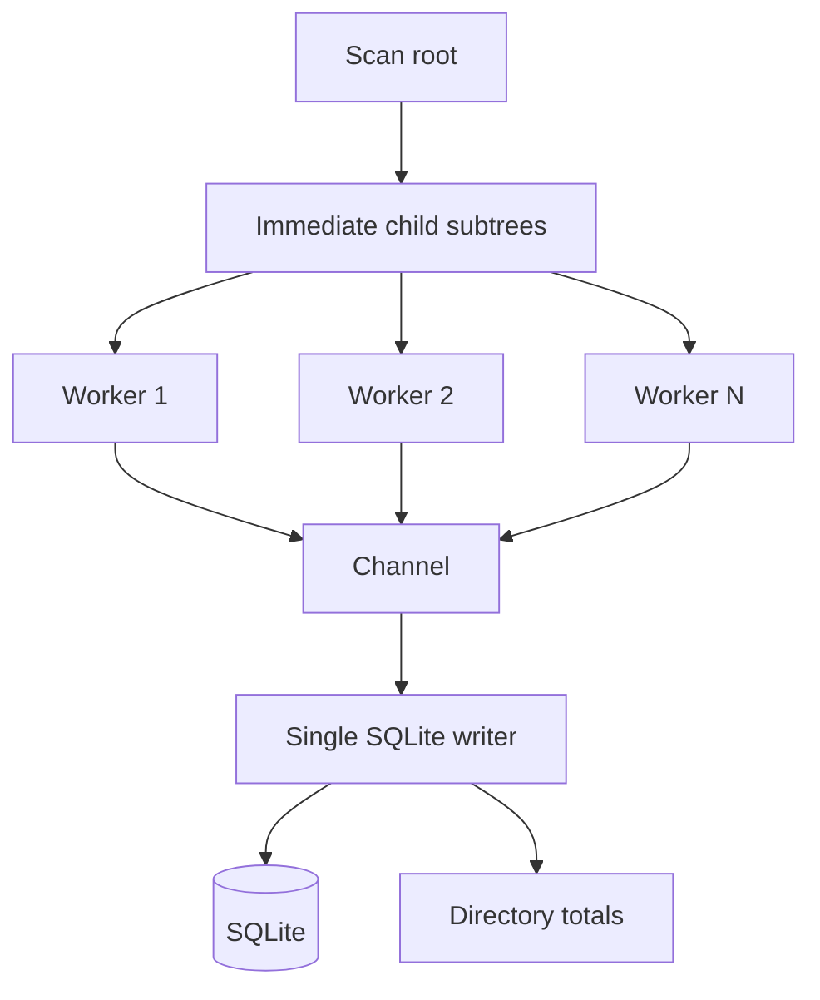

# Parallel Scanning

## Problem

The original scanner performed traversal, metadata reads, aggregation, and SQLite writes in one loop.

That is safe but too serial for large home directories, developer workspaces, and cache-heavy machines.

## Milestone 6.1 design

Parallelize the expensive read side:

```text
root
-> immediate child subtrees
-> worker threads walk subtrees and read metadata
-> channel
-> single SQLite writer / aggregator
```



## Why not parallel SQLite writes?

SQLite can handle concurrency, but the scanner does not need to start there.

A single writer keeps:

- transaction behavior simple
- ordering irrelevant
- error handling centralized
- DB contention low
- correctness easier to reason about

## Command

```bash
tidyfs scan ~ --jobs 8
```

Default job count uses:

```rust
std::thread::available_parallelism()
```

The actual worker count is capped by the number of immediate child paths.

## Tradeoffs

### Pros

- better metadata-read throughput
- simple DB safety model
- no new dependencies
- no AI/safety boundary changes

### Cons

- if one immediate child subtree dominates the whole scan, work may still be imbalanced
- aggregation is still single-threaded
- SQLite insert throughput remains serialized
- no bounded channel/backpressure tuning yet

## Future improvements

Potential next steps:

- use `jwalk` or `ignore::WalkParallel`
- use bounded channels
- batch SQLite inserts
- maintain per-worker partial aggregations
- merge directory totals at the end
- optional `--no-parallel`
- progress reporting
- cancellation handling
